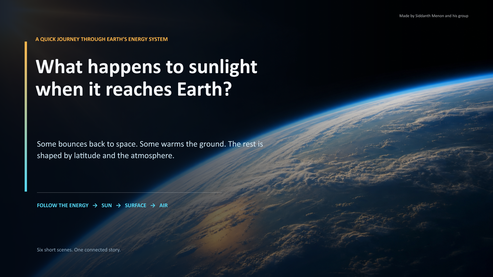

# What Happens to Sunlight When It Reaches Earth?

An immersive six-slide Grade 9 presentation that explains where sunlight goes, why surfaces warm differently, why cities stay hot, how latitude changes solar energy, and how the atmosphere affects temperature.



## Files

- `solar-radiation-immersive-high-resolution.pptx`: editable PowerPoint with vector text, native slide transitions and speaker notes.
- `docs/`: dependency-free animated web edition for GitHub Pages with 2560 by 1440 slide images.

## Upload using the GitHub website

1. Extract the ZIP file first. Do not upload the ZIP itself.
2. On GitHub, create a new repository. A public repository is the simplest option for GitHub Pages.
3. Open the new repository and choose **Add file → Upload files**.
4. Drag in `README.md`, `solar-radiation-immersive-high-resolution.pptx`, and the complete `docs` folder. Keep the folder structure unchanged.
5. Add a commit message such as `Add solar radiation presentation`, then click **Commit changes**.
6. Open **Settings → Pages**.
7. Under **Build and deployment**, choose **Deploy from a branch**.
8. Select the `main` branch and the `/docs` folder, then save.

GitHub will show the public Pages address after the deployment finishes. It usually follows this pattern:

`https://YOUR-USERNAME.github.io/YOUR-REPOSITORY/`

## Upload using Git

Run these commands from inside the extracted project folder:

```bash
git init
git add .
git commit -m "Add solar radiation presentation"
git branch -M main
git remote add origin https://github.com/YOUR-USERNAME/YOUR-REPOSITORY.git
git push -u origin main
```

Then enable GitHub Pages from the `main` branch and `/docs` folder as described above.

The published presentation has visible previous/next buttons and also supports arrow keys, Page Up/Down, swipe gestures, autoplay with the space bar, and fullscreen with `F`.

## Present locally

Open `docs/index.html` in a browser. For the best fullscreen experience, serve the folder with any static file server, although the presentation has no external dependencies.

## Source

Content was adapted from the three textbook screenshots supplied for this task. The visuals were generated specifically for this presentation.
